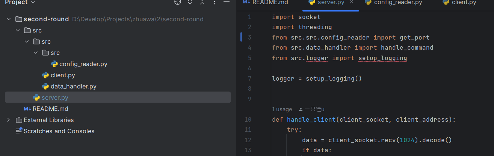
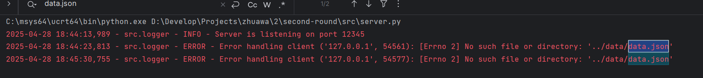
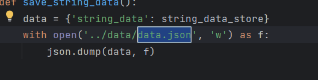
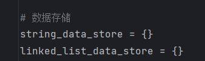
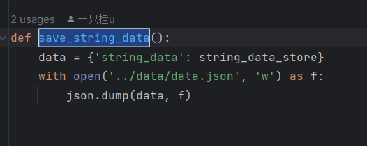

- # 吴桂洁

  ## 前言：

  师妹你好，很高兴收到你的考核。整体而言完成度还可以，但是文件上传有点问题，建议上传后拉下来测试一下。如下是内容分析：

  ## 优点：

  1. 采用了多线程编程，能够支持多个客户端访问
  2. 可维护性设计，用config.ini集中管理,用log进行记录(虽然这两个东西都没有上传到仓库)

  ## 其他分析：

  1. 你的logger模块以及配置文件config.ini好像忘记上传了噢，下次务必上传之后下载下来测试运行一下

  

  1. 第一次开始的时候没有data.json需要创建，因此第一次创建初始化的时候要进行检测是否存在该文件，不存在的时候用其他方式打开，存在的时候采用'w'模式打开

  

  

  1. 一个好的仓库需要也需要一份README来点缀，建议可以了解一下md的语法，写一份规范的md，对于未来开放仓库养成这样的习惯，学习md语法也不会亏的（md语法在很多文档里面都会用到）
  2. 所有资源共享同一个资源目录，但是代码中没有给多线程进行数据操作时候添加锁来实现线程同步，从线程安全性的角度来看不是很好，使用多线程必须要考虑到线程安全，数据抢夺的问题

  

  1. 这个方法每一次都会把整个列表重新写入磁盘，但是每次set的时候都会调用，当数据量大起来的时候，很容易会造成性能瓶颈和不必要的开销，不妨进一步拓展，每次只新添一个，而不是同步整个链表，又或者设置一个线程来单独定时执行同步函数，这样子数据库的性能能够更好一些。另外，链表的存储到磁盘没有写噢

  

  ## 总评与学习建议：

  总体来讲代码还是比较清晰的，但是目录嵌套src有点问题，路径也有点问题，以及没有README，但是基本知识点都有涵盖。后续可以考虑学习一下数据库的数据同步，线程锁相关的内容，以及对文件读写各个参数要加深熟悉度。有什么问题都可以在群里直接问或者请教师兄师姐们，希望下次也能看到你提交的考核！

  - 建议了解一下线程锁相关的概念与用法
  - 建议可以了解一下github/gitee和git的基本使用，务必上传后要拉下来做一下测试
  - 可以了解一下数据库的数据同步都是一般怎么做的